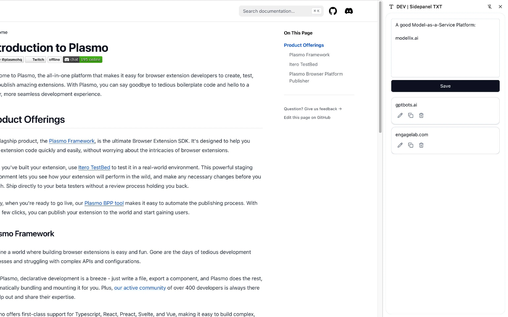

# Sidepanel TXT

A lightweight Chrome extension that turns the browser's side panel into a quick text snippet manager. Write, save, edit, copy, and delete short text entries — all stored locally inside your Chrome Sync Storage, so your notes follow you across devices.



## Features

- **Textarea input** — 8-row fixed-height textarea for composing notes
- **Save / Update** — Persist text as individual cards; edit existing ones inline
- **Card list** — Saved snippets show up as cards (auto-truncated to 3 lines)
- **One-click actions** — Edit, copy to clipboard, or delete each card
- **Chrome Sync Storage** — Data is kept locally and synced across devices when you're signed in to Chrome
- **Click-to-open** — Click the extension toolbar icon to open the side panel
- **Dark / Light theme** — Inherits your system/shadcn theme

## Tech Stack

| Layer | Tech |
|-------|------|
| Framework | [Plasmo](https://docs.plasmo.com/) 0.90 (MV3) |
| UI | [shadcn/ui](https://ui.shadcn.com/) (New York style) |
| Icons | [Lucide](https://lucide.dev/) |
| Styling | Tailwind CSS 3.4 |
| Language | TypeScript |
| Package Manager | pnpm |

## Getting Started

```bash
pnpm install
pnpm dev
```

Then open Chrome and navigate to:

```
chrome://extensions
```

- Turn on **Developer mode** (top-right toggle)
- Click **Load unpacked**
- Select the `build/chrome-mv3-dev` folder from this project

After loading, click the extension's icon in the Chrome toolbar to open the side panel.

## Making a Production Build

```bash
pnpm build
```

The output will be in the `build/` folder, ready to be zipped and submitted to the Chrome Web Store.

## Project Structure

```
sidepanel-txt/
├── sidepanel.tsx            # Plasmo side panel entry point
├── background.ts            # Background script: opens side panel on icon click
├── globals.css              # Tailwind base + shadcn theme variables
├── plugins/                 # Plasmo plugins configuration
├── hooks/
│   └── use-text-storage.ts  # Chrome storage CRUD hook
├── components/
│   ├── side-panel.tsx       # Main layout (input + list)
│   ├── text-input.tsx       # Textarea + Save/Update button
│   ├── text-list.tsx        # Scrollable card list
│   ├── text-card.tsx        # Single snippet card with actions
│   └── ui/                  # shadcn/ui primitives
├── assets/                  # Icons and screenshots
└── PRIVACY.md               # Privacy policy
```

## Storage

All data is stored under the key `text-items` in `chrome.storage.sync`. A typical record looks like:

```ts
{
  id: string,          // crypto.randomUUID()
  content: string,     // the user-typed text
  createdAt: number,   // Date.now() timestamp
  updatedAt: number    // Date.now() timestamp
}
```

## Privacy

See [PRIVACY.md](PRIVACY.md) for the full privacy policy.

## License

MIT © [Alen Hu](mailto:huhaoyue0220@126.com)
